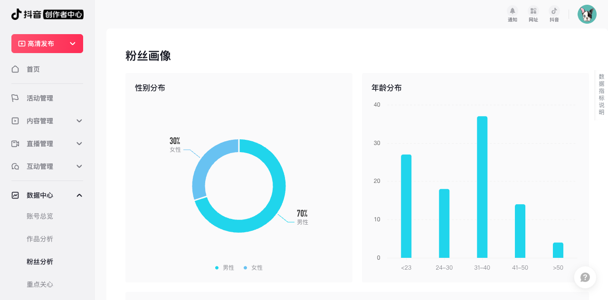

<p align="center">
  
  <h1 align="center">Douyin Data Scraper 🎬</h1>
  <p align="center">
    <strong>一键爬取你的抖音创作者数据，生成专业 Excel 报表</strong>
  </p>
  <p align="center">
    
    
    
    
  </p>
</p>

---

## 🤔 这是什么

抖音创作者中心没有数据导出功能。想要分析自己的账号数据？只能手动截图、一个个抄数字。

**Douyin Data Scraper** 是一个 [WorkBuddy Skill](https://github.com/dantewoo/workbuddy)，用 AI Agent + 浏览器自动化帮你：

1. 🔐 **扫码登录**抖音创作者中心
2. 🕷️ **自动爬取**三大模块数据（账号总览 / 作品列表 / 粉丝画像）
3. 📊 **一键生成**格式化 Excel 报表

不需要写代码，不需要装环境，跟 AI 说句话就行。

---

## ✨ 特性

| | 传统方式 | 本工具 |
|---|---|---|
| 数据获取 | 手动截图 | ✅ 自动爬取 |
| 作品数据 | 逐条复制 | ✅ 官方导出（最精确） |
| Excel 报表 | 手动排版 | ✅ 专业格式化 |
| 播放量分析 | 逐条对比 | ✅ TOP10 柱状图 |
| 粉丝画像 | 截图凑合 | ✅ 结构化表格 |
| 登录态 | - | ✅ 扫码/短信验证码 |

---

## 📸 效果预览

### Excel 报表 - 逐个作品数据


### Excel 报表 - 粉丝画像


---

## 🚀 使用方式

### 前置条件

- 安装 [WorkBuddy](https://github.com/dantewoo/workbuddy)
- 安装本 Skill（见下方安装部分）

### 一行命令

打开 WorkBuddy，对 AI 说：

```
爬抖音数据
```

或者：

```
导出抖音数据
```

就完了。AI 会自动：

1. 打开浏览器 → 抖音创作者中心
2. 弹出二维码 → 你掏手机扫码
3. 自动爬取 → 三大模块数据
4. 自动生成 → 格式化 Excel 并打开

---

## 📦 安装

### 方式一：从 Skill 市场（推荐）

> 🚧 即将上线

### 方式二：手动安装

```bash
# 克隆仓库
git clone https://github.com/dantewoo/douyin-data-scraper.git

# 复制到 WorkBuddy Skills 目录
cp -r douyin-data-scraper/ ~/.workbuddy/skills/douyin-data-scraper/
```

### 验证安装

重启 WorkBuddy，说"爬抖音数据"，如果 AI 开始打开浏览器，说明安装成功。

---

## 📋 数据模块详情

### Module 1: 账号总览

| 指标 | 说明 |
|------|------|
| 账号名 / 抖音号 | 基础信息 |
| 粉丝数 / 总获赞 | 核心指标 |
| 播放量 / 主页访问 / 点赞 / 分享 / 评论 | 昨日/7天/30天 |
| 封面点击率 / 净增粉丝 / 取关 | 深度指标 |
| 排名（高于 X% 创作者） | 行业对比 |

### Module 2: 作品列表（官方导出）

**优先使用抖音官方「导出数据」功能**，这是最精确的数据源。降级方案用页面解析。

每条作品包含 17 个字段：

| 字段 | 说明 |
|------|------|
| 作品标题 | 自动去重（抖音有时标题重复两遍） |
| 话题标签 | 从标题 `#标签` 提取 |
| 发布时间 / 视频时长 | 基础信息 |
| 播放量 / 完播率 / 5s完播率 | 核心数据 |
| 封面点击率 / 2s跳出率 / 平均播放 | 深度数据 |
| 点赞 / 评论 / 分享 / 收藏 | 互动数据 |
| 主页访问 / 粉丝增量 | 转化数据 |

### Module 3: 粉丝画像

| 数据 | 说明 |
|------|------|
| 地域分布 | 省份 + 占比 |
| 兴趣分布 | 类别 + 占比 |
| 粉丝热词 | 关键词 + 热度 |

---

## 🎨 Excel 报表规格

### Sheet 1: 逐个作品数据

- 🎯 播放量 ≥ 10万 → 黄色高亮
- 🔢 数字千分位格式（如 1,234,567）
- 📊 百分比自动转换（0.141827 → 14.2%）
- 📈 播放量 TOP10 柱状图
- ❄️ 首行冻结 + 自动筛选
- 🎨 深蓝表头 + 偶数行斑马纹

### Sheet 2: 账号概览

- 账号基本信息
- 作品统计汇总
- 昨日 / 7天 / 30天数据
- 环比变化 + 排名

### Sheet 3: 粉丝画像

- 地域分布表（省份 + 占比）
- 兴趣分布表（类别 + 占比）
- 粉丝热词表（关键词 + 热度）

---

## 🏗️ 技术架构

```
┌─────────────┐     ┌──────────────┐     ┌──────────────┐
│  WorkBuddy   │────▶│  AI Agent    │────▶│  agent-      │
│  用户指令    │     │  (本 Skill)  │     │  browser     │
└─────────────┘     └──────┬───────┘     └──────┬───────┘
                           │                     │
                    ┌──────▼───────┐      ┌──────▼───────┐
                    │  数据处理    │      │  抖音创作者   │
                    │  + Excel生成 │      │  中心页面     │
                    └──────────────┘      └──────────────┘
```

**核心设计原则：**

- 🧠 **AI 驱动而非选择器驱动** — 抖音创作者中心是 SPA，DOM 结构经常变。我们不写死 CSS 选择器，而是让 AI 实时看页面、动态找元素、灵活应对变化
- 📤 **优先官方导出** — 作品列表数据优先使用抖音内置的「导出数据」功能，比页面解析精确得多
- 🛡️ **只爬自己的号** — 仅用于创作者本人账号，不提供爬取他人数据的功能

---

## 🔧 工作流程

```
Phase 0: 检查登录态
    │
    ├─ 已登录 ──────────────────────┐
    │                               │
    └─ 未登录 → Phase 1: 扫码登录   │
                                    │
Phase 2: 爬取账号总览 ◄────────────┘
    │  ├─ 昨日数据
    │  ├─ 近7天数据
    │  └─ 近30天数据
    │
Phase 3: 爬取作品列表
    │  ├─ 优先：官方导出（精确）
    │  └─ 降级：页面解析
    │
Phase 4: 爬取粉丝画像
    │  ├─ 地域分布
    │  ├─ 兴趣分布
    │  └─ 粉丝热词
    │
Phase 5: 生成 Excel 报表
    │  ├─ Sheet 1: 逐个作品数据 + TOP10 图表
    │  ├─ Sheet 2: 账号概览
    │  └─ Sheet 3: 粉丝画像
    │
    └─ 🎉 自动打开 Excel 文件
```

---

## ⚠️ 注意事项

- **仅供个人使用** — 只爬取你自己的账号数据
- **数据时效** — 爬取的是当前登录态下的实时数据
- **页面变化** — 抖音可能更新创作者中心页面，AI 会动态适应，但极端情况可能需要更新 Skill
- **Canvas 图表** — 性别/年龄分布可能是 Canvas 渲染，无法通过文本提取，后续可能需 OCR 补充

---

## 🛠️ 故障排除

| 问题 | 解决方案 |
|------|----------|
| 登录超时 | 刷新页面重试，或换扫码登录 |
| 页面加载慢 | 耐心等待，AI 会自动重试 |
| 官方导出按钮找不到 | 切到"列表"视图，再找导出按钮 |
| 导出文件不在 Downloads | 检查浏览器下载目录设置 |
| 数据为空 | 页面未完全加载，重新运行 |

---

## 📄 文件结构

```
douyin-data-scraper/
├── SKILL.md          # Skill 定义（核心文件）
├── README.md         # 你正在看的这个
└── docs/
    ├── excel-preview.png    # Excel 报表预览
    └── fans-preview.png     # 粉丝画像预览
```

---

## 🤝 贡献

欢迎提 Issue 和 PR！

1. Fork 本仓库
2. 创建特性分支 (`git checkout -b feature/amazing`)
3. 提交改动 (`git commit -m 'Add amazing feature'`)
4. 推送分支 (`git push origin feature/amazing`)
5. 创建 Pull Request

---

## 📜 License

MIT License

---

## 🙏 致谢

- [WorkBuddy](https://github.com/dantewoo/workbuddy) — AI Agent 运行平台
- [Playwright](https://playwright.dev/) — 浏览器自动化引擎
- [openpyxl](https://openpyxl.readthedocs.io/) — Excel 生成库

---

<p align="center">
  Made with ❤️ by <a href="https://github.com/dantewoo">dantewoo</a>
</p>
